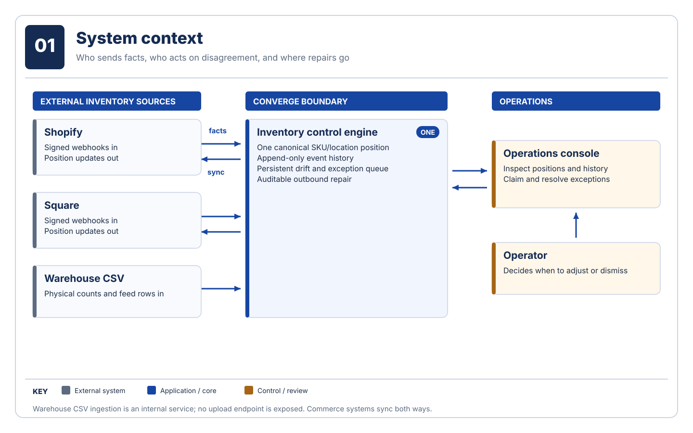

# Converge

[](https://github.com/santinomarial/Converge/actions/workflows/ci.yml)

Converge reconciles inventory across Shopify, Square, and a warehouse feed. It maintains one auditable position per SKU/location, detects persistent disagreement, and coordinates outbound repair when external writes are uncertain. It is a Spring Boot modular monolith with a React operations console, PostgreSQL event log, Kafka-compatible transport, and Redis-backed rate limiting.



## Run locally

Docker with Compose is required; JDK 21 is needed to run the tests outside the image.

```bash
git clone https://github.com/santinomarial/Converge.git
cd Converge
docker compose up -d --build
./gradlew test
```

Open the [operations console](http://localhost:8080), [Grafana](http://localhost:3000), and [health check](http://localhost:8080/actuator/health). A fresh database intentionally shows empty inventory. The local profile leaves the API open for development; production uses HTTP Basic authentication and a write-request header.

For port overrides, the first inventory example, and shutdown instructions, follow the [quickstart](docs/tutorials/quickstart.md).

## Documentation

Start with the [documentation map](docs/README.md), or go directly to:

| Need | Go to |
| --- | --- |
| Understand the system | [Architecture](docs/explanation/architecture.md) and [six-diagram gallery](docs/diagrams/README.md) |
| Understand the correctness guarantee | [Convergence and replay](docs/explanation/convergence.md) |
| Integrate an API client | [API reference](docs/reference/api.md) and [configuration](docs/reference/configuration.md) |
| Operate or recover it | [Reliability and observability](docs/explanation/reliability.md) and [rebuild a projection](docs/how-to/rebuild-projection.md) |
| Evaluate deployment | [Fly.io deployment guide](docs/how-to/deploy-to-fly.md) and [measured performance](docs/reference/performance.md) |

The [production topology](docs/diagrams/06-production-topology.svg) is a deployment target. A checked-in `fly.toml` and Docker image do not imply that a Fly app or its managed dependencies have been provisioned or deployed.
