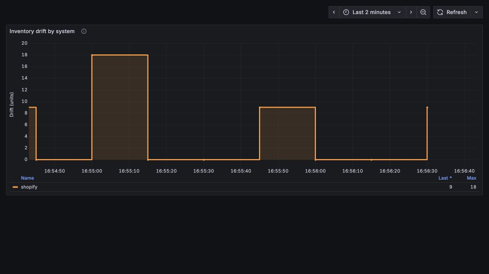
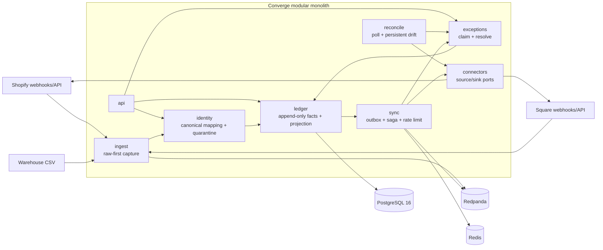

# Converge

[](https://github.com/santinomarial/Converge/actions/workflows/ci.yml)

Converge is an inventory reconciliation and sync engine for businesses that sell through Shopify and Square while fulfilling from a warehouse feed. Those systems deliver facts late, twice, out of order, or not at all—and an external write can succeed just before the network fails. Converge gives operations one canonical, auditable position per SKU/location, detects persistent disagreement, and drives repair without pretending a remote transaction can be rolled back.



## Run it

Requirements: Docker with Compose and JDK 21 for the Gradle test command.

```bash
git clone https://github.com/santinomarial/Converge.git
cd Converge
docker compose up -d --build
./gradlew test
```

Open the operations console at [http://localhost:8080](http://localhost:8080), Grafana at [http://localhost:3000](http://localhost:3000), Prometheus at [http://localhost:9090](http://localhost:9090), and health probes at [http://localhost:8080/actuator/health](http://localhost:8080/actuator/health). Grafana is anonymously accessible in the local stack and provisions `Converge inventory drift` automatically.

The console reads live positions, observed Shopify/Square quantities, active exceptions, drift samples, event history, and pending outbound syncs from the API. A new database therefore opens to honest empty states, not example inventory. Export CSV exports the current filtered position set; resolution and force-sync controls report API failures without pretending they succeeded. The local profile leaves the API open for development. Production requires the console credentials described below.

If a default port is already occupied, every published port is overridable—for example:

```bash
APP_PORT=18080 POSTGRES_PORT=15432 REDPANDA_PORT=19092 \
REDPANDA_ADMIN_PORT=19644 REDIS_PORT=16379 PROMETHEUS_PORT=19090 \
GRAFANA_PORT=13000 OTEL_HTTP_PORT=14318 docker compose up -d --build
```

Stop the stack with `docker compose down`. Named PostgreSQL and Redis volumes remain intact.

## Architecture

This is a Spring Modulith: one deployable, one transaction boundary, explicit application modules. The build verifies module boundaries and generates PlantUML documentation under `build/spring-modulith-docs/` from the code.



### Data path

1. A webhook is HMAC-verified and durably inserted into `raw_webhook` before the request returns `200`.
2. A Redpanda consumer resolves external identifiers. Missing mappings are quarantined; the engine never guesses.
3. A normalized fact is appended to `inventory_event`. PostgreSQL's unique `(source_system, external_event_id)` constraint is the idempotency authority.
4. The current `inventory_position` is projected in the same transaction and an outbound message is inserted into `outbox`.
5. The relay and saga apply token-bucket limits, circuit breaking, retries, and explicit compensation. Persistent failures become operator-owned exceptions.

The important tables are created by seven versioned [Flyway migrations](src/main/resources/db/migration): `inventory_event`, `inventory_position`, canonical mappings, quarantine, raw webhooks, drift samples, exceptions, outbox, sync attempts, and compensation records.

## Three decisions I made and why

### 1. PostgreSQL as the event store

The inventory log needs append-only writes, JSON payloads, global sequencing, uniqueness, row/advisory locks, and atomic projection/outbox updates. PostgreSQL already provides all of those and keeps the correctness boundary in one transaction. A dedicated event-store product would add another operational system and a dual-write problem without buying a capability this workload needs. Redis only short-circuits known duplicates and manages rate-limit tokens; losing it cannot violate idempotency.

The tradeoff is write amplification and hot-table growth. Converge accepts that cost to keep append, projection, replay, and outbox publication inside one durable transaction. Incremental checkpoints keep ordinary writes independent of aggregate history length, while replay and shadow verification preserve the audit guarantee.

### 2. A modular monolith instead of microservices

Inventory ingestion, ledger projection, outbox creation, and exception opening share invariants that benefit from a local transaction and direct types. Splitting them into services would turn those invariants into distributed protocols before team or throughput pressure justified it. Spring Modulith makes coupling visible and fails the build on illegal module dependencies, leaving explicit, extraction-ready boundaries rather than package folklore.

The tradeoff is one scaling and failure domain. Today that is deliberate: webhook handling uses Java 21 virtual threads and asynchronous normalization, while scheduled workers can be tuned independently inside the same process.

### 3. Honest compensation instead of pretend rollback

Once Shopify or Square accepts a write, a database rollback cannot undo it. The saga records each attempt and, after a partial failure, appends a causally linked correction and re-pushes the desired position. After the configured attempt limit it opens an exception and stops retrying. This leaves an audit trail and makes uncertainty visible rather than claiming atomicity across APIs that do not participate in our transaction.

The tradeoff is temporary external inconsistency and operator work for irrecoverable cases. That is safer than silent divergence or an infinite retry storm.

## The convergence property

For one SKU/location, let `S*` be the snapshot with the greatest `(occurred_at, seq)` and let `D_after` be all delta facts whose event time is strictly after that snapshot. The projection is:

```text
position(E) = quantity(S*) + Σ quantity(d), d ∈ D_after
```

If no snapshot exists, the anchor quantity is zero and all deltas participate. Therefore, for any permutation `π` of the same delta facts:

```text
position(π(E)) = position(E)
```

Late deltas at or before the current anchor are retained as `absorbed`; they are auditable but cannot move the projection. Rebuilding from sequence zero produces the same position table.

This is checked over 250 generated cases per property in [LedgerConvergenceProperties.java](src/test/java/io/converge/ledger/LedgerConvergenceProperties.java), against real PostgreSQL replay in [LedgerServiceIntegrationTest.java](src/test/java/io/converge/ledger/LedgerServiceIntegrationTest.java), and under concurrent duplicate delivery in [ConcurrentDuplicateWebhookChaosTest.java](src/test/java/io/converge/chaos/ConcurrentDuplicateWebhookChaosTest.java).

## Correctness and failure testing

There are no mocked repositories. Integration tests run against PostgreSQL, Redpanda, and Redis Testcontainers; external commerce APIs use WireMock.

| Risk | Executable evidence |
|---|---|
| Event reordering | jqwik permutations of deltas and snapshot/delta interleavings |
| Projection loss | Truncate and replay reproduces the exact projection |
| Incremental projector defect or crash | Every adversarial append is compared with an independent full-history reducer; a crash at a deterministic random sequence and deliberate corruption are detected and repaired by replay |
| Duplicate storms | 50 concurrent copies produce one ledger row |
| Kafka partition during a burst | Redpanda is paused while 100 webhooks accumulate; committed offsets resume with no loss or failed raw records |
| Database loss after a remote write | Toxiproxy cuts PostgreSQL between Shopify success and local acknowledgement; the expired saga lease reads remote state and completes without a second write |
| Shopify throttling | WireMock returns `429` for a wall-clock 60 seconds; the breaker leaves work queued and drains it after recovery |
| Outbox atomicity | Event and outbox commit together against PostgreSQL |
| Connector behavior | Shopify and Square signatures, errors, stable idempotency keys, and payloads exercised through WireMock over bounded HTTP/1.1 clients |
| Persistent drift | An exception opens only on the second consecutive non-zero observation |
| Human repair | `FOR UPDATE SKIP LOCKED` claim; resolution appends an adjustment |
| Architecture erosion | Spring Modulith boundary verification on every test run |

The chaos scenarios are part of the normal Gradle test task, including the intentional 60-second throttling window. They exercise the same workers and database state machine used in production rather than a parallel test-only implementation.

## Observability

Micrometer exposes `inventory_drift{system=...}`, `inventory_projection_shadow_verified_total`, and `inventory_projection_shadow_mismatches_total` at `/actuator/prometheus`. Prometheus scrapes every five seconds, Grafana provisions the checked-in [dashboard JSON](monitoring/grafana/dashboards/inventory-drift.json), and Micrometer tracing exports OTLP spans through the OpenTelemetry Collector. Local sampling defaults to 100%; `fly.toml` reduces it to 10%.

The screenshot above is from the provisioned Grafana 12 dashboard against a Prometheus series that rose to 18 units and recovered to zero. Severity is separate from the product's crimson brand palette: Grafana and the operations console use amber/orange for drift.

Useful endpoints:

- `POST /webhooks/shopify` and `POST /webhooks/square` — HMAC-verified ingestion
- `POST /api/identity/skus`, `/locations`, `/sku-mappings`, and `/location-mappings` — register canonical SKUs/locations and map them to external systems
- `GET /api/positions` (optionally filtered by `sku`/`location`), `GET /api/positions/{sku}/{location}`, and `GET /api/positions/{sku}/{location}/history`
- `POST /api/sync/{sku}/{location}` — force a manual re-push of the current position to every mapped external system
- `GET /api/drift?system=shopify&window=PT24H`
- `GET /api/exceptions?state=OPEN&severity=CRITICAL`, `POST /api/exceptions/{id}/claim`, and `POST /api/exceptions/{id}/resolve`
- `GET /api/connectors/health` — per-connector status and circuit breaker state
- `POST /api/admin/replay` — truncate and rebuild every position from full event history
- `GET /actuator/health/liveness` and `/actuator/health/readiness`
- `GET /actuator/prometheus`

## Load test

The checked-in [k6 scenario](load/webhook.js) creates canonical mappings, signs each Shopify payload, and drives the complete raw-first HTTP ingestion path with a constant arrival rate. It requires a running stack:

```bash
docker run --rm -v "$PWD/load:/scripts:ro" grafana/k6:2.2.0 run \
  -e BASE_URL=http://host.docker.internal:8080 \
  -e RATE=500 -e DURATION=30s -e VUS=500 -e MAX_VUS=500 \
  /scripts/webhook.js
```

Measured from a clean database and broker on 2026-08-31 on an Apple Silicon development machine, with the JVM on the host and PostgreSQL/Redpanda/Redis in Docker:

| Arrival rate | Completed | Failures | Average ack | p95 | p99 | Max |
|---:|---:|---:|---:|---:|---:|---:|
| 500/s for 30s | 15,001 | 0% | 7.87 ms | 37.01 ms | 118.81 ms | 298.95 ms |

These are acknowledgement numbers: the endpoint returns only after durable raw capture, then normalizes asynchronously. This deliberately hostile run sent all 15,001 facts to one SKU/location. Projection remained bounded and caught up after the burst; the aggregate lock serialized that one key while unrelated keys remained independently processable.

Normal writes no longer reduce the full history. A delta performs an atomic checkpoint update, and a snapshot replaces the anchor only when its `(occurred_at, seq)` wins. `last_applied_seq` records progress. The independent full reducer is reserved for explicit replay and a rotating shadow-verification batch, so history length no longer increases the cost of every ordinary event.

## Configuration and deployment

The production image is a multi-stage build: Node compiles the React console, Gradle produces the Spring Boot jar, and a Java 21 JRE runs both as one artifact. GitHub Actions runs the entire Testcontainers suite, builds the console, and builds that Docker image.

`fly.toml` targets Fly.io in `iad`, enables readiness checks, and keeps one 1 GB shared machine running continuously. This is required for the embedded Kafka consumers, projector, reconciliation loop, and outbound workers; an HTTP-idle machine would stop processing events. The `prod` profile refuses to start with missing credentials, development defaults, local infrastructure addresses, or non-HTTPS connector URLs. Converge requires durable PostgreSQL, Redis, and Kafka-compatible endpoints. Create the Fly app and provision these services before the first deploy, then set secrets:

```bash
flyctl secrets set \
  DATABASE_URL='jdbc:postgresql://HOST:5432/converge?sslmode=require' \
  DATABASE_USERNAME='...' DATABASE_PASSWORD='...' \
  KAFKA_BOOTSTRAP_SERVERS='...' REDIS_HOST='...' REDIS_PORT='6379' \
  SHOPIFY_BASE_URL='https://YOUR-SHOP.myshopify.com' \
  SHOPIFY_ACCESS_TOKEN='...' SHOPIFY_WEBHOOK_SECRET='...' \
  SQUARE_BASE_URL='https://connect.squareup.com' \
  SQUARE_ACCESS_TOKEN='...' SQUARE_WEBHOOK_SIGNATURE_KEY='...' \
  SQUARE_NOTIFICATION_URL='https://YOUR-APP.fly.dev/webhooks/square' \
  CONSOLE_USERNAME='...' CONSOLE_PASSWORD='A-UNIQUE-RANDOM-20+-CHARACTER-SECRET'

flyctl deploy
```

The production API and Prometheus endpoint use HTTP Basic authentication; webhook POSTs and health checks remain public. Use the console credentials for API access, and configure the same credentials in any Prometheus scraper. For a TLS/SASL Kafka provider, also set `KAFKA_SECURITY_PROTOCOL=SASL_SSL`, `KAFKA_SASL_MECHANISM`, and `KAFKA_SASL_JAAS_CONFIG`. Set `REDIS_SSL_ENABLED=true` for TLS Redis. Verify the provider's required URL/port and network rules before deploying. Do not put credentials in `fly.toml` or Git. The application name can be changed there if `converge-inventory-santinomarial` is unavailable.
