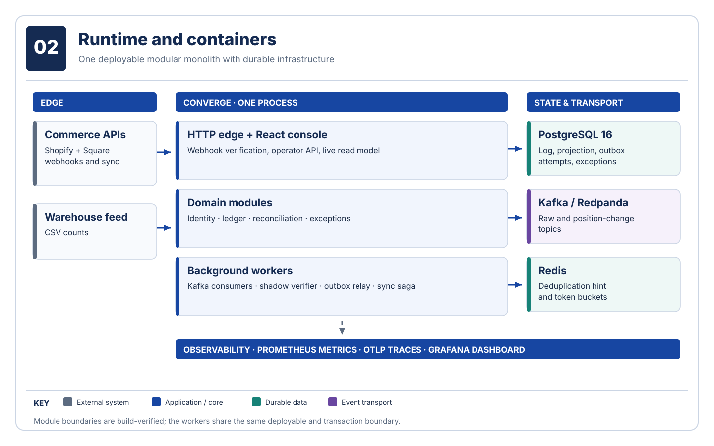
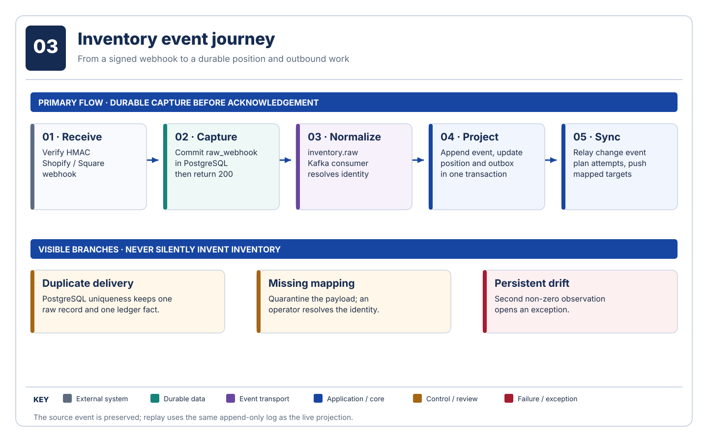
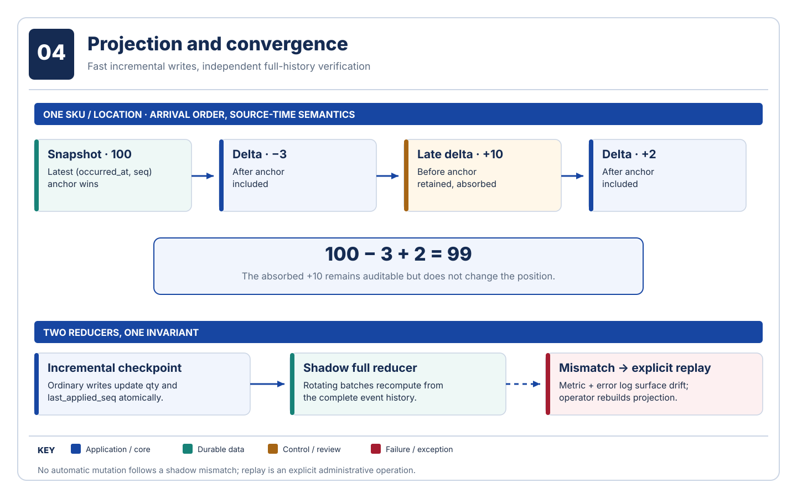

# Architecture diagram gallery

Read these diagrams from the outside in, then follow an inventory fact through projection and recovery. Each diagram answers one question and uses the same visual key: blue for application behavior, teal for durable data, purple for event transport, amber for operator control, red for exceptions, and slate for external systems. The production view is a target, not evidence of a live deployment.

The presentation is an original, editable SVG treatment informed by the [TOGAF diagrams gallery](https://github.com/nelsambrose/togaf-diagrams): numbered plates, section bands, consistent color roles, directional arrows, and a legend on every page. The choice of context, container, and dynamic views follows the [C4 model](https://c4model.com/diagrams). We use Converge's own architecture terms, not TOGAF-specific notation.

| Read | Diagram | Question answered |
| --- | --- | --- |
| 01 | [System context](01-system-context.svg) | Who sends facts, who operates Converge, and where do repairs go? |
| 02 | [Runtime and containers](02-runtime-containers.svg) | What runs in the application, and which infrastructure persists work? |
| 03 | [Inventory event journey](03-event-journey.svg) | How does a webhook become a position and outbound work? |
| 04 | [Projection and convergence](04-projection-convergence.svg) | How do late facts, incremental updates, and full replay agree? |
| 05 | [Outbound sync and recovery](05-sync-recovery.svg) | What happens when a remote write succeeds, times out, or fails? |
| 06 | [Production topology](06-production-topology.svg) | What is the intended deployment boundary and its dependencies? |

## 01 · System context

## 02 · Runtime and containers

## 03 · Inventory event journey

## 04 · Projection and convergence

## 05 · Outbound sync and recovery

## 06 · Production topology

The SVGs are committed for direct viewing on GitHub. Their source of truth is [`render.py`](render.py); run `python3 docs/diagrams/render.py` after changing the diagram content. Each SVG includes a title and description for assistive technology.

The warehouse CSV parser and ingestor exist as an internal service, not as a public upload endpoint or scheduled feed connector. The gallery distinguishes the intended production topology from currently provisioned infrastructure.
