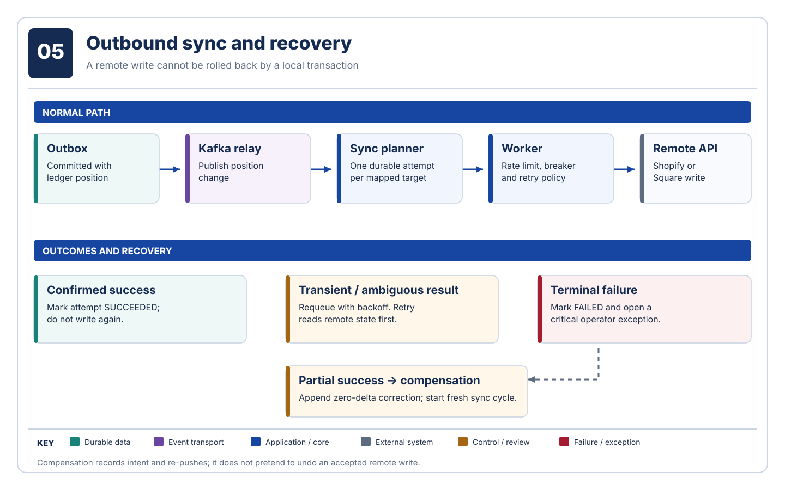

# Reliability and observability

Converge treats duplicates, late facts, lost acknowledgements, API throttling, and persistent drift as ordinary operational states. This page describes the actual safeguards and the executable evidence for them.

## Failure behavior

| Risk | Safeguard and executable evidence |
| --- | --- |
| Event reordering | jqwik permutations cover deltas and snapshot/delta interleavings. |
| Projection loss | Truncation and full replay reproduce the exact projection. |
| Incremental projector defect or crash | Adversarial appends are compared with an independent full-history reducer; crash-at-sequence and deliberate-corruption tests detect divergence and recover by replay. |
| Duplicate storms | 50 concurrent copies produce one ledger row. |
| Kafka partition during a burst | Redpanda is paused while 100 webhooks accumulate; committed offsets resume with no loss or failed raw records. |
| Database loss after a remote write | Toxiproxy cuts PostgreSQL between Shopify success and local acknowledgement; an expired saga lease reads remote state and completes without a second write. |
| Shopify throttling | WireMock returns `429` for a wall-clock 60 seconds; queued work drains after the breaker recovers. |
| Outbox atomicity | Event and outbox commit together against PostgreSQL. |
| Connector behavior | Shopify and Square signatures, errors, idempotency keys, and payloads run through WireMock over bounded HTTP/1.1 clients. |
| Persistent drift | An exception opens on the second consecutive non-zero observation. |
| Human repair | `FOR UPDATE SKIP LOCKED` claim; an `ADJUST_TO` resolution appends an adjustment. |
| Architecture erosion | Spring Modulith verifies module boundaries on test runs. |

Integration tests use PostgreSQL, Redpanda, and Redis Testcontainers rather than mocked repositories. The chaos scenarios run in the normal `./gradlew test` task, including the intentional 60-second throttle interval.

## Signals

Micrometer exposes `inventory_drift{system=...}`, `inventory_projection_shadow_verified_total`, and `inventory_projection_shadow_mismatches_total` at `/actuator/prometheus`. Local Prometheus scrapes every five seconds. The checked-in [Grafana dashboard](../../monitoring/grafana/dashboards/inventory-drift.json) visualizes drift; Micrometer tracing exports OTLP spans through the local collector. Sampling defaults to 100% locally; `fly.toml` configures 10% for the production target.

The screenshot is from the provisioned Grafana 12 dashboard against a Prometheus series that rose to 18 units and recovered to zero. Drift uses amber/orange severity rather than the product's crimson brand color.

Useful probes are `/actuator/health/liveness` and `/actuator/health/readiness`. In production, `/actuator/prometheus` requires the operator's HTTP Basic credentials; health probes do not. See the [API reference](../reference/api.md) and [configuration reference](../reference/configuration.md).
