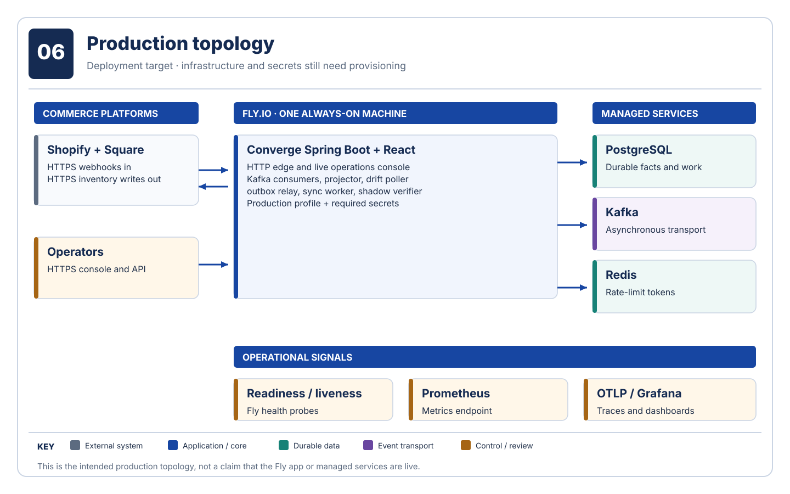

# Deploy to Fly.io

This is a deployment procedure for the checked-in [Fly configuration](../../fly.toml), **not a statement that Converge is deployed**. The target is one always-on, 1 GB shared Fly Machine in `iad`. Embedded consumers, reconciliation, outbox relay, sync worker, and shadow verifier require a continuously running process. You must provide durable PostgreSQL, Redis, and Kafka-compatible endpoints separately.



## Prerequisites

- A Fly.io account and current `flyctl`, authenticated to the intended organization.
- A reachable PostgreSQL database, Kafka-compatible broker, and Redis instance, with backups, credentials, TLS/network rules, and capacity appropriate to your environment.
- Shopify and Square credentials, webhook secrets, and an HTTPS public hostname for this Fly app.
- An operator username and a unique password of at least 20 characters; a Prometheus scraper configured to authenticate if metrics are collected externally.
- A successful local `./gradlew test`, console build, and production-image build. CI runs these checks, but does not deploy.

The production profile rejects missing or placeholder secrets, localhost dependencies, non-HTTPS connector URLs, and a non-PostgreSQL JDBC URL. Check the [configuration reference](../reference/configuration.md) before creating the app.

## Provision and configure

1. Set the unique Fly app name in `fly.toml` if `converge-inventory-santinomarial` is unavailable. Create that app with `flyctl apps create <app-name>` (or attach to an existing app you own). The checked-in `fly.toml` is already the deployment configuration.
2. Provision the three durable services and verify the Fly Machine can reach their endpoints. A local `localhost` URL will not work from Fly.
3. Set the required secrets on the Fly app. The values below are placeholders; enter actual values through your approved secret-management workflow, not into Git:

   ```bash
   flyctl secrets set --stage \
     DATABASE_URL='jdbc:postgresql://HOST:5432/converge?sslmode=require' \
     DATABASE_USERNAME='...' DATABASE_PASSWORD='...' \
     KAFKA_BOOTSTRAP_SERVERS='...' REDIS_HOST='...' REDIS_PORT='6379' \
     SHOPIFY_BASE_URL='https://YOUR-SHOP.myshopify.com' \
     SHOPIFY_ACCESS_TOKEN='...' SHOPIFY_WEBHOOK_SECRET='...' \
     SQUARE_BASE_URL='https://connect.squareup.com' \
     SQUARE_ACCESS_TOKEN='...' SQUARE_WEBHOOK_SIGNATURE_KEY='...' \
     SQUARE_NOTIFICATION_URL='https://YOUR-APP.fly.dev/webhooks/square' \
     CONSOLE_USERNAME='...' CONSOLE_PASSWORD='A-UNIQUE-RANDOM-20+-CHARACTER-SECRET'
   ```

   Fly documents [staged secrets](https://fly.io/docs/flyctl/secrets-set/) for deploying them with the next release. For a TLS/SASL Kafka provider, also set `KAFKA_SECURITY_PROTOCOL=SASL_SSL`, `KAFKA_SASL_MECHANISM`, and `KAFKA_SASL_JAAS_CONFIG`. Set `REDIS_SSL_ENABLED=true` for TLS Redis. Confirm provider-specific ports and network rules.
4. Deploy from the repository root with `flyctl deploy`. The image builds the React console with Node and the Spring Boot jar with Gradle, then runs both through a Java 21 JRE image.

## Verify before enabling real traffic

Check deployment status and logs with `flyctl status` and `flyctl logs`. Confirm `https://<app-name>.fly.dev/actuator/health/readiness`, then authenticate to the console and verify the live API. Test signed webhooks with your provider's test flow, inspect raw capture and mapped positions, confirm Kafka consumers and outbound attempts, and verify PostgreSQL backups plus external monitoring. Do not treat a green HTTP health check alone as proof of end-to-end readiness.

Production `/api/**` and `/actuator/prometheus` require HTTP Basic authentication. API writes additionally require `X-Converge-Request: console`; the UI sends that header. Webhook POSTs and health probes remain unauthenticated at the HTTP layer, but webhooks require provider HMAC signatures. Do not place secrets in `fly.toml` or Git.

This procedure follows Fly's current [manual app creation and deployment flow](https://fly.io/docs/launch/create/) and [app configuration reference](https://fly.io/docs/reference/configuration/). Recheck provider guidance before an actual rollout.
